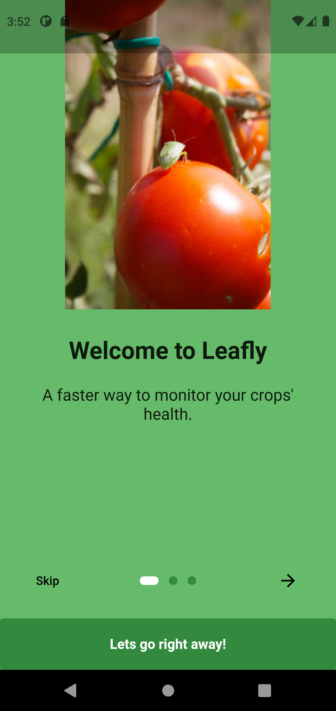
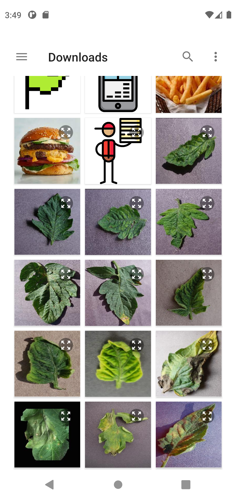

# leafly
APT4900-A Applied Computer Technology Project for Spring Semester 2022. Using machine learning to 
detect diseases in tomato crops from pictures of their leaves.

# Features

A user is able to:

* Sign up if they are a new user
* Sign in
* Select a photo from their gallery
* Take a photo with their camera
* Get results of scanned photo
* Edit their account details

An administrator is able to 
* Sign in
* View and delete users
* View some statistics on a dashboard
* Generate a report on most frequently detected diseases

# What I Learned

* How to create a convolutional neural network that uses computer vision to detect tomato diseases
* How to integrate a machine learning model with a Flutter application
* CRUD operations on Firebase Firestore database
* Asynchronous functions in Flutter

# Screenshots

### Onboarding

### Sign in & Sign up Screen

 &nbsp;&nbsp;&nbsp;&nbsp; 

### Select a Photo Screen

 &nbsp;&nbsp;&nbsp;&nbsp; 

### Scan Results Screen

# Acknowledgments
* [Jeff Shelton Okang'a](https://github.com/Shelton17) was instrumental in documenting the project
* The data used to train the model was obtained from [Kaggle](https://www.kaggle.com/datasets/noulam/tomato)
* Photo and icon credits to [depositphotos](https://depositphotos.com/stock-photos/tomato-plant-disease-leaf.html?sh=a63f9077ad7264e37870756f0d9527d26fb01a87)
  and [flaticon](https://www.flaticon.com/)
* I used a model by [Animesh1911](https://github.com/Animesh1911/Tomato-Leaf-Disease-Detection)
* The design and fucntionality of the application was derived from [root458's project](https://github.com/root458/Plant-Disease-Detector)

# License

This project is licensed under the MIT license - see the
[LICENSE.md](https://github.com/eric-mahasi/leafly/blob/main/LICENSE.md)
for details.
